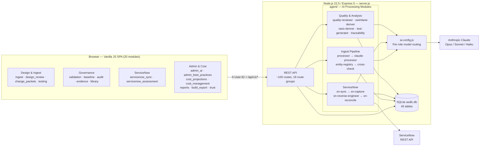
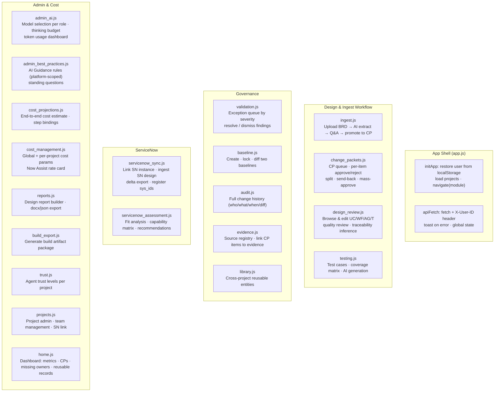
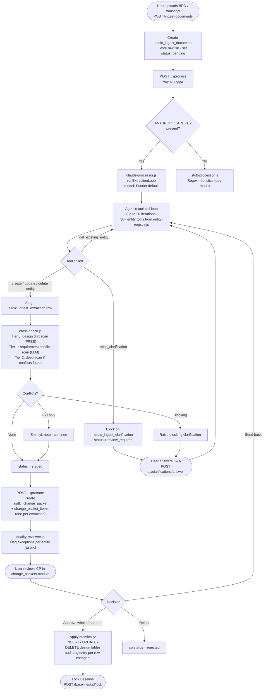
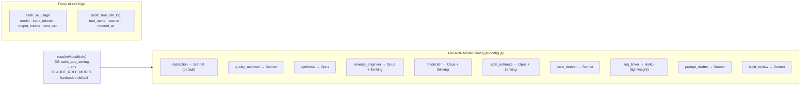
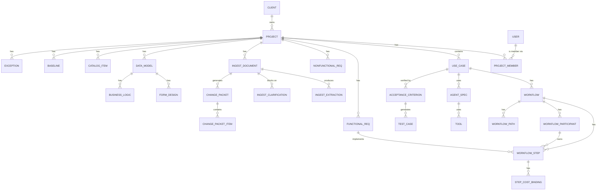

# Agentic SDLC Workbench — Architecture Reference

> **Purpose:** Functional blocks, relationships, data flows, and database schema for the Agentic SDLC Workbench. Intended as a handoff guide for developers extending the system.
>
> **Companion file:** `ARCHITECTURE.html` — interactive graphical version of this document (open in any browser).

---

## 1. What Is This?

The **Agentic SDLC Workbench** is a local-prototype web application for designing and managing ServiceNow Agentic AI applications. A delivery team uploads a Business Requirements Document (BRD) or transcript; Claude extracts structured design artifacts (use cases, workflows, agents, tools, requirements); the team reviews and approves changes; and the approved design flows back into a ServiceNow scope as a deployment artifact.

**Tech stack:**

| Layer | Technology |
|---|---|
| Runtime | Node.js ≥ 22.5 (built-in `node:sqlite`) |
| HTTP Server | Express 5 |
| Database | SQLite (`asdlc.db`, 45 tables) |
| Frontend | Vanilla JS, ES modules, no framework |
| AI Engine | Anthropic Claude API (Opus 4.8 / Sonnet 4.6 / Haiku 4.5) |
| ServiceNow | REST API + Fluent notation round-trip |

---

## 2. System Architecture



---

## 3. Functional Blocks

### 3.1 Frontend — 20 Modules

The SPA is a single `index.html` shell with a sidebar that loads one module per navigation item. Each module exports a `render(container)` function that calls the REST API and builds the UI via direct DOM manipulation (no framework).



### 3.2 REST API — Route Groups

| Group | Key Routes | Async? |
|---|---|---|
| Users / Dashboard | `GET /users`, `GET /dashboard` | No |
| Projects / Clients | `GET/POST/PUT /projects`, `/clients` | No |
| Change Packets | `GET/POST /change-packets`, approve/reject/split/send-back/mass-approve | No |
| Design Entities | Full CRUD for UC/WF/AG/T/AC/TC/FR/NFR/guardrail/data-source/user-story | No |
| Workflow RASIC & Paths | CRUD for participants / paths / RASIC matrix | No |
| Ingest Documents | Upload, process, promote, clarifications, content download | **Yes** (process, promote) |
| ServiceNow | sync, assess, delta-export, register-sysid, delta-info, import-profile | **Yes** (sync, assess) |
| Quality & Repair | quality-review/entity, quality-review/full, repair-design, traceability/infer | **Yes** |
| Cost | cost-estimate, cost-bindings CRUD | **Yes** (estimate) |
| Baselines | create, lock, compare (diff) | No |
| Exceptions | list, create, update, summary stats | No |
| Evidence & Audit | evidence-sources, audit-log | No |
| Reporting & Build | design-report/*, build-export | **Yes** (export) |
| Admin | AI settings, best-practices, usage stats, tool-call log | No |
| Library | cross-project reusable entities | No |
| Test Coverage | list, infer gaps, generate test cases | **Yes** (generate, infer) |

> **Async pattern:** Long-running endpoints return immediately and update `ingest_status` / `status` on the relevant row. The frontend polls `GET /.../:id` for status changes.

---

## 4. Key Data Flows

### 4.1 Ingest → Extract → Review → Approve



### 4.2 ServiceNow Round-Trip

```mermaid
flowchart TD
    A(["User links project to SN instance\nPOST .../servicenow-link"]) --> B["Store instance URL + scope\nEncrypt credentials AES-256-GCM\nper-project in asdlc_project"]
    B --> C["POST .../servicenow/assess ASYNC\nsn-assess.js (Opus + thinking)"]
    C --> D["Query SN REST API\nCapability matrix · volume · cost\nStore asdlc_sn_assessment"]
    D --> E(["User reviews fit report"])
    E --> F["POST .../servicenow/sync ASYNC\nsn-sync.js orchestrates:"]
    F --> G["sn-capture.js\nFetch Business Rules · Client Scripts\nUI Policies · Workflows · Catalog Items\n→ Fluent IR notation"]
    G --> H["Create asdlc_ingest_document\nenrichment_level = sn-reverse-engineer"]
    H --> I["claude-processor.js\nExtract Level-1 design from Fluent source\nwith source_sys_id + source_fluent provenance"]
    I --> J["sn-reconcile.js\nCompare inbound vs workbench design\nDetect: new · changed · deleted"]
    J --> K["Stage CP with cp_origin = sn_inbound\n(prevents pushing these back to SN)"]
    K --> L(["Same CP approval flow →\napproved items applied to design tables"])
    L --> M["GET .../servicenow/delta-export\nWorkbench-authored changes\n→ Fluent deployment plan"]
    M --> N(["Deploy to SN (manual / SDK)"])
    N --> O["POST .../servicenow/register-sysid\nWrite source_sys_id back to design rows\nEnables round-trip identity on next sync"]
```



**Slice-scoped ingest (import profile).** A large or global scope is too big to ingest whole, so
a project can save an **import profile** (`asdlc_project.sn_import_profile_json`; GET/PUT
`.../servicenow/import-profile`, seeded from the assessment's `recommended_profile`) that bounds
the ingest to a *slice*: a surface allowlist (+ the child tables of any included parent) and an
optional per-surface cap, with a reserved `record_filters` for a future record-level narrowing.
`captureScope`, the `sys_metadata` completeness sweep, **and** drift classification are all bounded
to the same slice (`agent/sn-capture.js` — `normalizeSlice`/`expandSliceSurfaces`/`sliceQuery`), so
out-of-slice Workbench rows are never mis-read as deleted upstream. The Assessment page makes census
surfaces selectable; Sync shows the active slice. `wipe-project.js` clears the SN substrate so a
slice can be re-ingested cleanly.

**Field-level two-way merge (R7).** `agent/three-way-merge.js` (`classifyFields`) compares each field
across three states — the last-synced base (`source_fluent`), the current Workbench value, and the
current ServiceNow value — bucketing it `unchanged | sn_only | wb_only | both_changed`. For **generic
artifacts** (whose Workbench payload *is* the ServiceNow payload) a both-side-edited record is merged
field-by-field instead of parked whole in review: `sn_only` changes auto-apply, every Workbench edit
(including a deliberate clear) is kept, and only a genuine `both_changed` field goes to human review.
For **rich (Tier-A)** records the deterministic SN-side field delta is fed into the reconciler prompt,
with the record-level both-side floor as the safe fallback (a full WB-field-space rich merge is #100).

### 4.3 AI Configuration & Model Routing



---

## 5. Database Schema

### 5.1 Domain Groups (45 tables total)

| Domain | Tables | Purpose |
|---|---|---|
| **Workspace & Access** | `asdlc_user`, `asdlc_client`, `asdlc_project`, `asdlc_project_member` | Multi-tenant workspace, team assignments |
| **Design — Tier 1** | `asdlc_use_case`, `asdlc_workflow`, `asdlc_workflow_step`, `asdlc_agent_spec`, `asdlc_tool`, `asdlc_hitl_gate` | Core UC→WF→Step hierarchy + agents |
| **Design — Tier 2** | `asdlc_workflow_participant`, `asdlc_workflow_path`, `asdlc_functional_req`, `asdlc_nonfunctional_req`, `asdlc_acceptance_criterion`, `asdlc_test_case` | RASIC, step transitions, requirements, test coverage |
| **Design — Level-1 SN** | `asdlc_data_model`, `asdlc_form_design`, `asdlc_business_logic`, `asdlc_catalog_item` | Reverse-engineered SN design with provenance |
| **BRD Materialized** | `asdlc_guardrail`, `asdlc_data_source`, `asdlc_user_story` | Governance rules, APIs, user stories from BRD |
| **Relationships** | `asdlc_agent_use_case`, `asdlc_agent_tool`, `asdlc_requirement_link`, `asdlc_workflow_step_cost_binding` | M:N bindings + traceability |
| **Ingest & Change** | `asdlc_ingest_document`, `asdlc_ingest_extraction`, `asdlc_ingest_feedback`, `asdlc_ingest_clarification`, `asdlc_change_packet`, `asdlc_change_packet_item` | Full ingest audit trail + change control |
| **Governance & Audit** | `asdlc_baseline`, `asdlc_exception`, `asdlc_audit_log`, `asdlc_ai_usage`, `asdlc_tool_call_log` | Versioning, quality findings, full audit |
| **Cost & Config** | `asdlc_cost_assumption`, `asdlc_assist_rate_card`, `asdlc_app_setting`, `asdlc_best_practice`, `asdlc_agent_catalog`, `asdlc_project_agent_setting`, `asdlc_sn_assessment` | Cost model, AI Guidance, admin config |

### 5.2 Core Entity Relationships (ERD)



### 5.3 Key Column Conventions

| Convention | Rule |
|---|---|
| Primary keys | UUID (`TEXT`) — generated by `db.generateId()` |
| Slugs | `UC-001`, `WF-002`, etc. — per-project sequence via `db.nextSlug()` |
| JSON columns | `goals`, `fields`, `relationships`, `requirement_ids` stored as JSON text |
| Lifecycle | Every entity has `lifecycle_status` (`active` / `archived` / `deprecated`) |
| SN provenance | Level-1 tables carry `source_sys_id`, `source_fluent`, `source_hash`, `source_scope` |
| Audit | Every write goes through `db.auditLog()` → `asdlc_audit_log` |
| Soft-delete | Entities are archived, not deleted (except explicit `DELETE` via CP item) |

---

## 6. Key Architectural Decisions

| # | Decision | What & Why |
|---|---|---|
| 1 | **Slug naming** | Every entity gets `UC-001`, `WF-002` etc. per project. Stable human-readable identifiers that survive in prompts, requirements docs, and audit trails. |
| 2 | **Supervision model enum** | `Advisory-only` / `Supervised HITL` / `Autonomous`. quality-reviewer validates required fields per model. Migrated from legacy `Assisted`. |
| 3 | **Per-item CP decisions** | Product owners approve/reject each CP item individually. Allows partial approvals; disputed items go back to the extraction loop. |
| 4 | **enrichment_level** | `faithful` (transcribe only) / `balanced` (fill implied, **default**) / `suggestive` (propose net-new). Controls how liberally Claude infers. |
| 5 | **Cross-check tiers** | Tier 0 free deterministic drift detection always runs. Tier 1 bounded LLM requirement conflict scan runs conditionally. Tier 2 deep scan only when severity warrants. |
| 6 | **ServiceNow provenance (Level-2)** | Design rows carry `source_sys_id` / `source_fluent` / `source_hash`. Enables deterministic round-trip identity. `cp_origin = sn_inbound` prevents inbound changes being pushed back to SN. |
| 7 | **Per-project cost params** | Cost overrides per application — different SN instances = different price sheets. Falls back to global `asdlc_cost_assumption` singleton. |
| 8 | **AI Guidance platform scoping** | House rules carry `platform` field (`servicenow` / `generic` / `any`). Injected per document platform; prevents cross-platform rule bleed. |
| 9 | **Cryptographic SN credentials** | Per-project SN login stored AES-256-GCM via `crypto-util.js`. Falls back to `SN_USER` / `SN_PASSWORD` env vars. Enables multi-tenant SN connectivity. |
| 10 | **Two-layer design model** | Level-1 = business design in plain English (shown in UI). Level-2 = SN `sys_id` + Fluent notation (hidden). Round-trip identity uses Level-2; all humans see Level-1. |

---

## 7. Extension Points

### Adding a new design entity type
1. Add table to `backend-node/schema.sql` (include `project_id`, slug, `lifecycle_status`, JSON columns)
2. Register in `agent/entity-registry.js` — add to `REGISTRY` and `buildApiTools()`
3. Add CRUD routes in `server.js` (follow existing pattern: list / get / create / update)
4. Add to `agent/quality-reviewer.js` required-fields check
5. Extend `frontend/modules/design_review.js` or create a new module

### Adding a new AI role
1. Add the role key to `agent/ai-config.js` `AVAILABLE_ROLES` map
2. Set a default model, thinking config, and fallback
3. Expose in `frontend/modules/admin_ai.js` for per-role UI selection
4. Call `resolveModel('new_role')` from your agent module

### Adding a new ServiceNow integration surface
1. Add capture logic to `agent/sn-capture.js` (fetch + convert to Fluent IR)
2. Add reverse-engineering handler to `agent/sn-reverse-engineer.js`
3. Add reconciliation logic to `agent/sn-reconcile.js` (compare inbound vs workbench)
4. Expose outbound export in `agent/sn-catalog.js` or a new export module
5. Register `sys_id` write-back in the `/register-sysid` endpoint in `server.js`

---

## 8. Running the Application

```bash
cd agentic-sdlc-workbench/backend-node
cp .env.example .env          # Set ANTHROPIC_API_KEY
npm install
node server.js                 # Starts on PORT (default 8000)
# Open http://localhost:8000
```

**Without `ANTHROPIC_API_KEY`:** Falls back to `stub-processor.js` (regex-based, no AI; safe for UI development).

**Database:** Auto-initialized from `schema.sql` on first start. Demo data (users, projects, CPs, baselines) seeded idempotently from `seed.js` on every restart.

**Environment variables:**

| Variable | Default | Purpose |
|---|---|---|
| `ANTHROPIC_API_KEY` | — | Required for real AI extraction |
| `PORT` | `8000` | Server port |
| `ASDLC_DB_PATH` | `backend-node/asdlc.db` | SQLite path |
| `ASDLC_ENCRYPT_KEY` | auto-generated | AES-256-GCM key for SN credentials |
| `CLAUDE_EXTRACTION_MODEL` | `claude-sonnet-4-6` | Override extraction model |
| `CLAUDE_SYNTHESIS_MODEL` | `claude-opus-4-8` | Override synthesis model |

---

## 9. File Map

```
agentic-sdlc-workbench/
├── backend-node/
│   ├── server.js             # Express app, all routes (~3500 lines)
│   ├── db.js                 # SQLite init, schema migrations, helpers
│   ├── schema.sql            # DDL for all 45 tables
│   ├── seed.js               # Demo data (idempotent)
│   ├── package.json
│   └── agent/
│       ├── ai-config.js         # Model routing, cost logging, best practices
│       ├── entity-registry.js   # Entity→table map, 30+ tool definitions
│       ├── processor.js         # Router: claude vs stub
│       ├── claude-processor.js  # Real Claude agentic extraction loop
│       ├── stub-processor.js    # Regex fallback (no API key needed)
│       ├── cross-check.js       # Conflict detection (3 tiers)
│       ├── quality-reviewer.js  # Exception detection per entity
│       ├── prompt-templates.js  # System prompt + clarification templates
│       ├── prompt-drafter.js    # Draft agent system prompts (AI)
│       ├── wiki-context.js      # SN wiki injection for extraction
│       ├── sn-sync.js           # SN round-trip orchestrator
│       ├── sn-capture.js        # Fetch SN source → Fluent IR
│       ├── sn-reverse-engineer.js # Level-1 design from Fluent
│       ├── sn-reconcile.js      # Compare inbound vs workbench
│       ├── sn-assess.js         # Fit analysis (read-only)
│       ├── sn-review.js         # Validate design vs SN best practices
│       ├── sn-catalog.js        # Export catalog items to Fluent
│       ├── swimlane-deriver.js  # Derive swimlane from WF definition
│       ├── rasic-deriver.js     # Derive RASIC matrix (Opus)
│       ├── test-generator.js    # Generate test cases from AC
│       ├── test-coverage.js     # Analyse coverage, recommend gaps
│       ├── traceability.js      # Infer FR→step traceability links
│       ├── design-repair.js     # Auto-repair missing owners/orphan reqs
│       ├── document-reader.js   # Extract text from docx/txt/csv
│       ├── fluent-ingest.js     # Parse Fluent notation IR
│       └── review-queue.js      # Clarification Q&A queue state
└── frontend/
    ├── index.html
    └── modules/
        ├── app.js                  # Bootstrap, routing, apiFetch
        ├── home.js                 # Dashboard
        ├── ingest.js               # Upload + extraction workflow
        ├── projects.js             # Project admin
        ├── trust.js                # Agent trust console
        ├── change_packets.js       # CP review queue
        ├── evidence.js             # Evidence registry
        ├── audit.js                # Audit log viewer
        ├── baseline.js             # Version management
        ├── library.js              # Cross-project library
        ├── validation.js           # Exception queue
        ├── design_review.js        # Design browser + editor
        ├── testing.js              # Test coverage
        ├── build_export.js         # Build artifact export
        ├── cost_projections.js     # Cost estimates
        ├── cost_management.js      # Rate card + cost params
        ├── reports.js              # Report builder
        ├── admin_ai.js             # AI settings
        ├── admin_best_practices.js # AI Guidance rules
        ├── servicenow_sync.js      # SN round-trip
        └── servicenow_assessment.js # SN fit analysis
```
